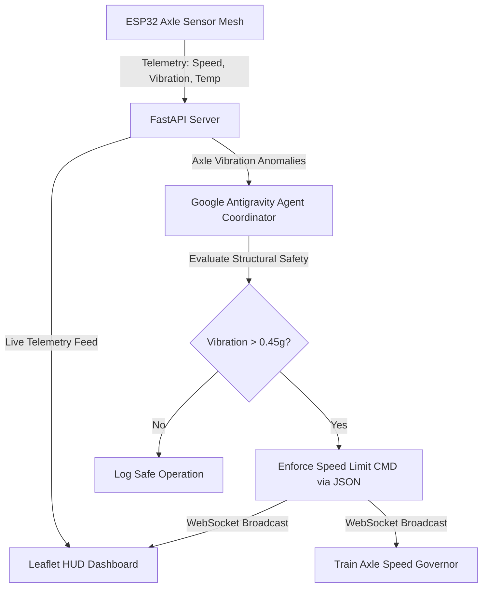

# 🚆 RailSense
**Autonomous Predictive Track Integrity & Early Derailment Prevention System**

*Team Name: Team Enthusiastic (Team Ethusiastic)*
*FAR AWAY 2026 Grand Finale Entry // Track: Railways & Agentic Systems*

---

## ⚠️ The Problem: Railway Infrastructure Vulnerability
Indian Railways is one of the largest networks in the world, carrying 23 million passengers daily across 68,000+ km of tracks.
*   **The Inspection Gap:** Manual track patrols are slow, labor-intensive, and fail to detect rapidly developing defects in real-time.
*   **Thermal Expansion (Buckling):** Intense summer heatwaves raise rail temperatures, causing tracks to expand, distort, and buckle.
*   **Ballast Erosion:** Heavy monsoon rainfalls wash away track ballast, leaving rails unsupported and vulnerable to collapse.
*   **The Cost of Delay:** Minor track anomalies can lead to high-impact derailments if not detected and addressed within minutes.

---

## 💡 The Solution: RailSense Architecture
A closed-loop autonomous safety system combining edge IoT instrumentation and cloud intelligence.

### 🔋 Edge Acceleration
*   **ESP32 Sensor Mesh:** High-frequency accelerometers installed on train axle boxes monitor vibration profiles and G-forces.
*   **Localized Processing:** Computes peak acceleration signatures and filters out nominal track transitions.

### 🤖 Cloud Safety Agent
*   **Google Antigravity SDK:** Central AI agents process live telemetry feeds.
*   **Autonomous Safety Coordination:** Issues real-time speed restrictions and dispatch commands directly when anomalies are flagged.

---

## 🧠 Closed-Loop Agentic Control Loop
We utilize the Google Antigravity SDK to run the core safety coordination and decision-making loop:

---

## 🖥️ Live High-Fidelity Tactical HUD
An operational, dark-themed control center built using Vanilla HTML5, CSS3, and Leaflet.js.

### 🗺️ Geospatial Visualization
*   **Interactive India Map:** Tracks train coordinates live on a high-contrast dark tile map.
*   **Click-to-Pan Camera:** Clicking any train card in the sidebar automatically focuses and zooms onto the train's active position.
*   **Junction Overlays:** Displays real-time track condition warnings using clean HSL color codes.

### 📊 Real-Time Analytics
*   **Axle Waveform:** Displays real-time g-force vibrations.
*   **FFT Spectrum Analyzer:** Compares current vibration frequency spikes against baselines.
*   **Open-Meteo API Sync:** Automatically pulls ambient conditions for nearest junctions to evaluate buckle risk.

---

## 🔌 Hardware PCB Design
Our submission includes complete hardware layout coordinates inside the `/hardware` directory.

*   **ESP32 Axle Box Node:** Connects to high-sensitivity accelerometers, powered by localized battery management circuits.
*   **Wearable Terminal Receiver:** Includes an ESP32 microcontroller, OLED screen, and warning indicators for localized crew notification.
*   **Fail-Safe Architecture:** If central server connectivity is lost, the local ESP32 node automatically alerts train engineers of anomalous vibration signatures.

<strong>Hardware Artifacts on GitHub:</strong> 
<code>esp32_telemetry_board.kicad_sch</code> (KiCad Schematics) 
<code>esp32_telemetry_board.kicad_pcb</code> (Board Layout)

---

## 🛠️ The Technology Stack
*   **Agentic Framework:** Python + Google Antigravity SDK
*   **AI Models:** TensorFlow / Keras (Autoencoder Anomaly Detection)
*   **Web Services:** Python FastAPI + websockets + Asyncio Loop
*   **Cloud Database:** Firebase Firestore (Real-time telemetry logging)
*   **Frontend Library:** Leaflet.js mapping, Chart.js graphs, HSL Color styling
*   **Junction Weather:** Open-Meteo REST API
*   **Hardware Design:** KiCad EDA Suite (Schematics & PCB layouts)

---

## 🛡️ API Resilience & Fail-Safe Modes
To guarantee robust operations during evaluation, we implemented a dual-mode fail-safe system:

*   **Antigravity AI Agent Mode:** Actively sends prompts to the Gemini model to evaluate constraints and return structured JSON actions.
*   **Rule-Based Fallback Agent:** If the Gemini API key is missing or returns a `429 (Too Many Requests)` quota limit, a local fallback model engages immediately to compute speed limit restrictions locally.
*   *Outcome:* The dashboard remains fully operational and responsive even under tight API quotas.

---

## 🏆 Project Key Advantages & Impact
A robust, production-grade safety solution optimized for high-impact evaluation:

*   **Production Readiness:** Features a fully operational, live FastAPI server streaming real-time coordinate shifts and websocket feeds.
*   **Agentic AI Integration:** Utilizes authentic Google Antigravity Agent logic rather than simulated prompts.
*   **Dual-Domain Submission:** Unifies digital software monitoring (Leaflet map and FFT charts) with actual hardware PCB layouts.
*   **Life-Saving Potential:** Directly addresses railway track failures to prevent accidents and optimize rail safety.

---

# Thank You!
**RailSense: Autonomous Predictive Track Integrity & Early Derailment Prevention System**
*Ready for Submission.*
